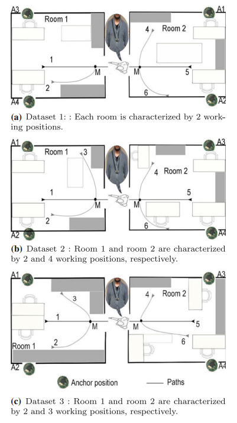

# Prediction of User Movements in Heterogeneous Indoor Environments using radio signal strength index

A small wireless sensor network (WSN) comprised of 4 anchors placed on the corner of two rooms and a mote attached to the subjects were used to collect RSS.
RSS data exchanged between the mote and the anchors were collected at 4 Hz in three different room settings.

Two classification models are built.

* The [first one](tsc1.ipynb) is to identify whether a subject has moved across rooms based on RSS.
* The [second one]() is to identify the path of a subject.

There are 314 RSS time series data files. The smallest data has 19 seconds worth of data and the largest data has 129 seconds of data. There are 4 signals per second.
